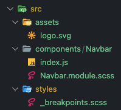

# Redux + Toolkit

```bash
yarn add react-redux @reduxjs/toolkit
```


* **`Action`** -> é um objeto, que **obrigatoriamente** contém um `type` com o nome da action e opcionalmente um `payload`;

  * Essa action é algo que irá acontecer no **`reducer`**;

    ```json
    {
      type: ‘incrementar’,
      payload: {
        id: ‘123’ // id que quero incrementar
        quantidade: 2 // quantidade que quero incrementar
      }
    }
    ```

* **`Dispatch`** -> É uma função que **irá disparar uma action**;

  ```react
  const dispatch = useDispatch();
  dispatch(incrementar(2));
  ```

* **`Immer`** -> É uma biblioteca usada para lidar com a imutabilidade, sem q a gente precise se preocupar em mutar um estado ou não;

* **`Imutabilidade`** -> É o ato de nunca mudar um dado, oq faz que a tool seja mais performática. No redux nunca retornamos um estado mudado, e sim um novo estado ;

* **`InitialState`** -> É um objeto/array com o estado inicial que o `slice` irá precisar ;

  * ```javascript
    const initialState = []
    const categoriesSlice = createSlice({
      name: "categoriesSlice",
      initialState,
    });
    ```

* **`Provider`** -> É um componente da lib redux que permite que todos componentes acessem um `store`;

  * Usado diretamente no `index.js` da root do projeto

  * ```react
    import { Provider } from "react-redux";
    import store from "./store";
    
    const root = ReactDOM.createRoot(document.getElementById("root"));
    root.render(
      <React.StrictMode>
        <Provider store={store}>
          <Router />
        </Provider>
      </React.StrictMode>
    );
    ```

* **`Reducer`** -> É uma função q recebe as `actions` e os `initialStates`, e sempre retornam um novo estados;

  * ```react
    function contadorReducer(state = 0, action) {
      if(action.type === ‘incrementar’) {
        return state += action.payload;
      }
      return state;
    }
    ```

* **`Redux Toolkit`** -> É uma lib que facilita o uso do Redux, como facilitar o uso de `Reducers` com `slicers`;

* **`Redux`** -> É uma lib do javascript;

* **`Slice`** -> É uma função do redux toolkit que nos facilita usar `reducers` ;

  * ```react
    import { createSlice } from '@reduxjs/toolkit';
    
    const contadorSlice = createSlice({
      name: ‘contador’ // nome do reducer
      initialState: 0 // estado inicial do reducer
      reducers: {
        incrementar: (state) => { // esta função é uma action, ele automaticamente gera um type ‘contador/incrementar’
          state++ // esta linha parece simples, mas ela utilizará o Immer por debaixo dos panos para incrementar o contador com imutabilidade!
        }
      }
    })
    
    const { incrementar } = contadorSlice.actions; // contadorSlice.actions contém todas as actions criadas.
    const contadorReducer = contadorSlice.reducer; // aqui está o reducer, que deve ser indexado ao Store
    ```

* **`state`** -> É um termo do Redux, que se refere na verdade ao **estado atual do reducer**. Dentro do `useSelector` o state receber todos os o componentes do `Store`;

* **`useSelector`** -> É um hook que permite que seja acessado os estados armezanados no `Store`;

  * ```react
    const contador = useSelector(state => state.contador); // Aqui temos que escrever state.contador pois state é o store inteiro, e contador é o state do reducer de nome contador.
    ```

* **`state`** -> ;

# Sumário

1. [Projeto](#projeto)
2. [Gerenciamento de Estados Globais](#gerenciamento)
3. [Tópicos Adicionais](#adicionais)

# Projeto<a href="projeto" />

* Curso: https://cursos.alura.com.br/course/react-gerenciamento-estados-globais-redux/
* Projeto: https://github.com/alura-cursos/trato-tech/tree/aula1.2


# Gerenciamento de Estado Globais <a href="gerenciamento" />


## Why Redux?


React por motivos de performance foi desenvolvido para ser **one-way data binding**, ou seja, **informações vão do pai para o filho** via props, caso a gente queira **trocar informações entre components primos**, usamos do **prop drilling**

```react
function Pai() {
  const [prop, setProp] = useState(‘’);
  return (
    <Filho1 prop={prop} />
    <Filho2 prop={prop} />
  )
}
```


## Implementando Redux

### Store

O `Store` precisa de `reducers`, que serão os responsáveis por conter `slices` /pedaçoes do store...

* Criar o `/store/index`;
  * Para configurar um `store` precisamos do `configureStore`, que recebe um objeto com `reducers`

```react
// /store/index.js
const { configureStore } = require("@reduxjs/toolkit");

const store = configureStore({
  reducer: {} //aqui dentro irá os reducers
})
```


### Reducer

O `reducer` é onde ficará os dados em si (aquilo que antes seria um `useState` , ficará global, através do reducer)

* `reducer` é criado através de um `createSlice`, que irá receber:
  * `name` (nome que será usado globalmente)
  * `initialState` (estado atual dos objetos/fields)

```javascript
// store/reducers/categories.js

const initialState = [
  {
    id: 1,
    name: 'xyz'
  }
]

const categoriesSlice = createSlice({
  name: 'categoriesSlice',
  initialState
})

export default categoriesSlice.reducer;
```


Juntando com o `store`:

```javascript
// store/index.js
import { configureStore } from "@reduxjs/toolkit";
import categoriaSlice from "./reducers/categories";

const store = configureStore({
  reducer: {
    categories: categoriaSlice,
  },
});

export default store;
```


### Provider

Para que todos componentes possam acessar os componentes globais, precisamos alterar o `index.js`, atribuindo um **`Provider`** a todos componentes:

* `Provider` espera um `store`, que é o arquivo criado acima

```react
import { Provider } from "react-redux";
import store from "./store";

const root = ReactDOM.createRoot(document.getElementById("root"));
root.render(
  <React.StrictMode>
    <Provider store={store}>
      <Router />
    </Provider>
  </React.StrictMode>
);
```


### Consumindo State

Com o Provider aplicado, podemos fazer uso do **`useSelector`**, para acessar todos os `states` criados pelo `store`

```react
export default function Home() {
  const categories = useSelector(state => state.categories)
  // categorias = [{id: 1, name: 'xyz'}] -> declarado no categoriesSlice
}
```

### Actions + Dispatch

Actions são responsáveis por **alterar o state**, mas para isso precisamos de `dispatch`!

* Com redux/toolkit, temos um hook chamado `useDispatch` que nos ajuda com isso!

Exemplo:

* Crie uma action `changeFavorite` que irá alterar a prop `favorite`
  * No Reducer, criado pelo `createSlice`inclua o objeto **`reducers`**, que irá receber as actions
  * Cada action irá receber `state, { payload }` -> onde:
    * `state`: é valor do `initialState`
    * `payload`: é o valor recebido pela função em si (`changeFavorite('oi')` => `payload = oi`)

```react
// store/reducers/items.js

const initialState = ...;

const itemSlice = createSlice({
  name: 'itemSlice',
  initialState,
  reducers: {
    // State aqui se refere ao Item e não ao Store!
    changeFavorite(state, { payload }) {
      state.map((item) => {
        if (item.id === payload) item.favorite = !item.favorite;
        return item;
      });
    }
  }
})
```

* ​	Exporte a função

```react
export const { changeFavorite } = itemSlice.actions;
```


Para utilizar a action, **utilizaremos do useDispatch**

```react
export default function ItemComponent(props) {
  const { id } = props;

  // disparando a change
  const dispatch = useDispatch();
  function handleFavorite() {
    dispatch(changeFavorite(id))
  }
  
  return <div onClick={handleFavorite} />
}
```


#### Push/Filter/Delete state

```bash
[Immer] An immer producer returned a new value *and* modified its draft. Either return a new value *or* modify the draft.
```

**CUIDADO**, ao tentar fazer um `push` ou `filter` de um state!

* Para evitar **problemas de imutabilidade** o Immer **não permite** que seja **incluído** no **state atual** um novo valor, **É NECESSÁRIO RETORNAR UM NOVO STATE**

Exemplo **errado** :x:

```react
const initialState = []

const seuSlice = createSlice({
  name: 'seuSlice',
  initialState,
  reducers: {
    
    myAction(state, {payload}) {
      // NÃO IRÁ FUNCIONAR, pois estamos dando um return do state atual
      return state.push({id:payload, quantity:1})
    }
  }
})
```

Exemplo **correto** :white_check_mark:

```react
const initialState = []

const seuSlice = createSlice({
  name: 'seuSlice',
  initialState,
  reducers: {
    
    myAction(state, {payload}) {
      // IRÁ FUNCIONAR - toolkit irá usar o immer para nós 
      state.push({id:payload, quantity:1})
    }
  }
})
```

Exemplo **correto** :white_check_mark:

```react
const initialState = []

const seuSlice = createSlice({
  name: 'seuSlice',
  initialState,
  reducers: {
    
    myAction(state, {payload}) {
      // IRÁ FUNCIONAR - retornamos um NEW state
      return [...state, {id:payload, quantity:1} ]
    }
  }
})
```


# Tópicos Adicionais <a href="adicionais"/>

## Classnames

```bash
yarn add classnames
```

O classnames nos ajuda a trabalhar com **classes de css  condicionais**, exemplo:

* Sem classname:

  ```react
  let selecionado = true;
  
  return	<div className={selecionado ? 'myCustomClass' : ''} />
  ```

* Com classname:

  ```react
  let selecionado = true;
  
  return <div className={classNames({ 'myCustomClass': selecionado })} />
  ```

Também é possível **adicionar mais de uma class ao elemento**, basta separarmos por vírgula:

* Exemplo, dado que `href` sempre tem que:
  * receber a class `links`
  * receber a class `selected` condicionamente (se estiver no path dado)

```react
import styles from "./Navbar.module.scss";
// com CSS Modules, é necessário por entre [] o estilo

return 
  <a
    href="/inicio"
    className={classNames(styles.link, {
      [styles.selected]: window.location.pathname === "/inicio",
    })}
  >
    Página Inicial
  </a>
```


## CSS Modules

```bash
yarn add sass
```

O Css Modules nos ajuda com:

* Evitar sobreposição de classes;
* Nos retorna um objeto que contém todos os estilos!

Exemplo:

* Sem CSS Module:

  ```react
  import './Navbar.scss';
  
  return <div className='nav' />
  ```

* Com CSS Module:

  ```react
  import styles from './Navbar.module.scss';
  
  // {nomeDaVariavel}.{nomeDaClasse}
  return <div className={styles.nav} />
  ```

  * Na prática, o browser irá criar um id para cada classe: `{nomeDaVariavel}.{nomeDaClasse}.{id}`

    ```html
    <!-- Neste exemplo a class '.nav' recebe id VwSpp-->
    <nav class=”Navbar_nav__VwSpp”> … </nav>
    ```


## JSConfig

```bash
jsconfig.json
```

JSConfig possui diversas propriedades, uma mais comum:

```json
{
  "compilerOptions": {
    "baseUrl": "src"
  },
  "include": ["src"]
}
```

* O **baseURL** nos deixa importar coisas de forma absoluta (**sempre começando de src**).

Exemplo considerando a estrutura abaixo, importe do `Navbar.module.scss` o `_breakpoints.scss`:



* Sem JSConfig:

  ```react
  @import '../../styles/breakpoints';
  ```

* Com JSConfig:

  ```react
  @import 'styles/breakpoints';
  ```


## Routes (relembrando)

```bash
yarn add react-router-dom
```

* Crie um arquivo `/src/routes.js`

  * **`BrowserRouter`** -> Criado para indicar que haverá mudança nas rotas;

  * **`Routes`** -> Indica que haverá várias `Route` dentro;

  * **`Route`** -> É onde informamos ao react qual `element` carregar quando o `path` der match;

  * **`Outlet`** -> É onde fica o conteúdo 'específico', ou seja, teremos um Navbar e um footer, o resto é o conteúdo específico;

  * **`Link`** -> Versão do `a href` para SPA;

  * **`useLocation`** -> hook para pegar informações do `pathname`;

    * ```react
      // Renderizar condicionalmente um icone baseado no pathname
      export default function Navbar() {
        const location = useLocation();
       
        return (
        	<div>
            {location.pathname === '/cart' ? (<Icon1 />) : (<Icon2 />)}
           </div>
        )
      }
      ```
  
  * **`useParam`** -> hook para pegar os parâmetros da URL - `/categoria/:nomeCategoria`;

    * ```react
      // routes.js -> Dado a rota com parametro
      // localhost/categoria/eletronic
      <Route path="/categoria/:nomeCategoria" element={<div>home</div>} />
      
      
      
      // index.js -> iremos pegar o nome da categoria
      // nesse caso '/eletronic'
      export default function Category() {
        const { nomeCategoria } = useParams("nomeCategoria");
      ```
  
  * **`useNavigate`** -> hook para navegar em **routes**;
  
    * ```react
      const navigate = useNavigate();
      
      // codigo omitido
      return
      	<div key={index} onClick={() => navigate(`/category/${category.id}`)} />
      ```


  ### Config Base de Route

  ```react
  import { BrowserRouter, Route, Routes } from "react-router-dom";
  import LandingPage from 'components/LandingPage'
  
  export default function Router() {
    return (
      <BrowserRouter>
        <Routes>
          <Route path="/" element={<LandingPage />}>
            <Route index element={<div>home</div>} />
            <Route path="/categoria/:nomeCategoria" element={<div>home</div>} />
          </Route>
        </Routes>
      </BrowserRouter>
    );
  }
  ```

* No `index.js` importe este arquivo

  ```react
  import React from "react";
  import ReactDOM from "react-dom/client";
  import Router from "routes";
  import "./index.css";
  
  const root = ReactDOM.createRoot(document.getElementById("root"));
  root.render(
    <React.StrictMode>
      <Router />
    </React.StrictMode>
  );
  
  ```


## Array.reduce

Precisar de alguma das operações abaixo, use o `reduce`!

* Transformar Array em objeto, string e etc
* Concatenar Array


`reduce` espera 2 valores:

1. `(finalValue, currentValue)` 
2. `initialValue`

Exemplo:

```javascript
const cartItems = [
  {
    id: '1',
    quantity: 1
  },
  {
    id: '2',
    quantity: 4
  },
]

const items = [ {id: 1, title: 'X'}, {id: 2, title: 'Y'} ]

// aplicando reduce para incluir informações de 'items' com 'cartItems'
const reduce = cartItems.reduce( (finalValue, cartItem) => {
   const item = items.filter(item => item.id === cartItem.id)
   finalValue.push({
     ...item,
     quantity: cartItem.quantity
   })
  
  return finalValue;
}, [])

console.log(reduce)
/*
[
  {
    id: '1',
    title: 'X',
    quantity: 1
  },
  {
    id: '2',
    title: 'Y',
    quantity: 4
  },
]
*/
```

